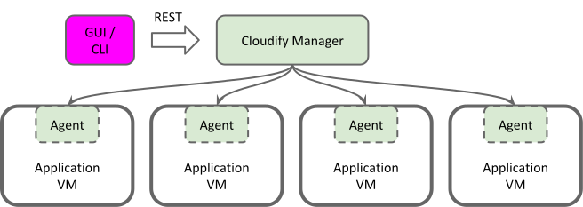
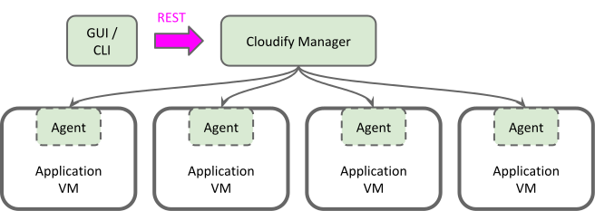
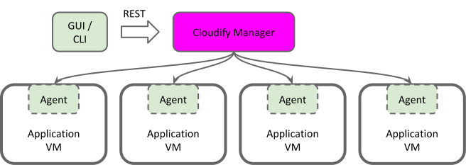
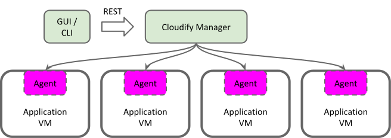

# An Overview of Cloudify Components

## THE FOUR COMPONENTS

From a high-level perspective, Cloudify has four components, as seen from the following diagram:

There must be a client, either in the form of the Cloudify CLI, or a separate GUI. The client communicates with the Cloudify Manager via a RESTful API, and finally, there are the Cloudify Agents, which run on the application VMs.

## THE CLI

You've already seen that the Cloudify command-line interface, or CLI, can be used to install blueprints locally. It is, however, most useful when it connects to the Cloudify Manager via the RESTful API.

It can be installed on any platform that supports Python, via RPM, pip, or simply by downloading the script. The only constraint is that the version used must be explicitly compatible with the running version of Cloudify Manager.

## THE RESTFUL API

The next Cloudify component is the API itself. It was designed using REST, lending it simplicity and reliability. (For a high-level overview of REST itself, Wikipedia has a good [article](https://en.wikipedia.org/wiki/Representational_state_transfer) on it.)

The API server is implemented by the Cloudify Manager (covered next), to be consumed by clients such as the CLI. You can find the full specification of the latest version the API [here](http://docs.getcloudify.org/api/a).

## THE MANAGER 

While you can use Cloudify to provision resources directly from the CLI, Cloudify Manager should be used to manage production level applications.

It is a dedicated environment that allows users to, among other things, manage application VMs, keep a directory of blueprints and create multiple deployments of each, view an application's topology, search logs, view metrics, and last but not least, manage the agents running on the application VMs.

## THE AGENTS

The last major component we'll cover is the Cloudify Agent. It is a service, installed on application hosts, whose main function is to communicate with and execute actions on behalf of Cloudify Manager.

Cloudify provides agent packages that support the following systems out of the box:

    - CentOS 6.4 - 7.x
    - Red Hat Enterprise Linux (RHEL) 7.x
    - Ubuntu 12.04 and 14.04
    - Windows 2008 and above
Note that it is not required to install agents on application VMs, though you will be limited in your choice of plugins if you don't. Puppet and Chef configuration management, for instance, only work if your application VMs have Cloudify Agents running.