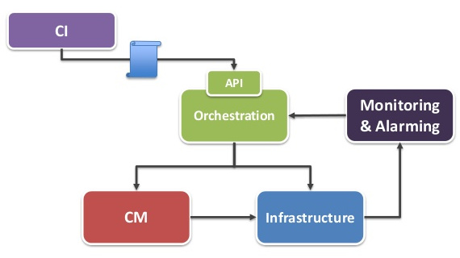

# Cloudify Deployment

You've learned about Blueprints, the Manager, API, Agents, and Workflows. But how does one use them to deploy an application, in practice?



## UPLOADING A BLUEPRINT

The first step in deploying an application with the Cloudify Manager is to upload it a blueprint. Using the CLI, the general form of the command is:

cfy blueprints upload -p [FILE] -b [ID]
Where [FILE] is the path to the YAML file, and [ID] is a unique name for the blueprint.

For example:

```yaml
cfy blueprints upload -p /home/cfy/blueprints/test-bp.yaml -b test
```

## CREATING A DEPLOYMENT

In the Cloudify Manager, a deployment is an instantiation of a blueprint. Each blueprint can have multiple deployments, each with different input and output parameters. As far as the number of deployments goes, you're only limited by the extent of your available infrastructure: each new installation of a deployment creates (or requires) more VMs.

This is the generic CLI command to create a blueprint deployment:

```yaml
cfy deployments create -b [BLUEPRINT_ID] -d [DEPLOYMENT_ID] -i [INPUTS]
```

Where [BLUEPRINT_ID] is the identifier of the previously uploaded blueprint, [DEPLOYMENT_ID] is an arbitrary name for this deployment, and [INPUTS] is the path to the YAML file containing inputs specific to this deployment.

For example:

```yaml
cfy deployments create -b test -d test_dep_1 -i inputs.yaml
```

## INSTALLATION

To install a blueprint deployment, you will invoke the install workflow. What it does is to actually create all specified nodes and establish their relationships in-place. The CLI command is:

```yaml
cfy executions start -d [DEPLOYMENT_ID] -w install
```

Where [DEPLOYMENT_ID] is the name given upon deployment creation, and -w invokes the install workflow.

## UNINSTALLATION

It is also possible to completely uninstall an application, by invoking the uninstall workflow. This will unlink all node relationships, and dispose of all previously created nodes.

```yaml
cfy executions start -d [DEPLOYMENT_ID] -w uninstall
```

Where [DEPLOYMENT_ID] is the name of the deployment, and -w invokes the uninstall workflow.

## LISTING THINGS

To list all uploaded blueprints:

```yaml
cfy blueprints list
```

To list deployments of a specific blueprint:

```yaml
cfy deployments list -b [BLUEPRINT_ID]
```

To list executions of a given deployment, including installations and uninstallations, run:

```yaml
cfy executions list -d [DEPLOYMENT_ID]
```