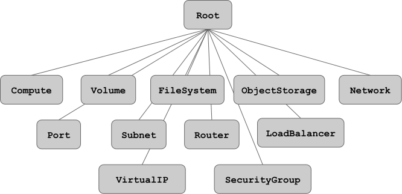

# Cloudify Blueprints

Let's get down to business and see how Cloudify expects an application to be defined in a blueprint.


## WHAT'S A CLOUDIFY BLUEPRINT?

In simple terms, a Cloudify Blueprint is a plan for orchestrating an application in the cloud. It describes the logical representation of an application, also called a topology. In a Blueprint you will describe the application's components, how they relate to one another, how they are installed and configured and how they're monitored and maintained.

They're written using YAML, in a Domain Specific Language based on the TOSCA Simple Profile in YAML.

## TOPOLOGY

In a Cloudify Blueprint, the term topology refers to the graph of application components and their relationships. Following TOSCA nomenclature, components are called nodes, and components relationships are called relationships. Nodes can be of different types, and implement properties and interfaces.

You can see the some of the above in the following example blueprint, which contains two nodes, a host and an http_web_server, and a relationship establishing that the web server is contained_in the host compute node:

```YAML
node_templates:
  host:
    type: cloudify.nodes.Compute
    properties:
      ip: { get_input: host_ip }
      install_agent: false

  http_web_server:
    type: cloudify.nodes.WebServer
    properties:
      port: { get_input: webserver_port }
    relationships:
      - type: cloudify.relationships.contained_in
        target: host
```

## NODE TYPES

Remember that the term node does not only refer to virtual machines. A node is any component in the topology, and while that certainly includes VMs, it can also refer to storage volumes, floating IP addresses, routers, and so on.

In a Cloudify blueprint, a node type is similar to a class in object-oriented programming. It defines the available properties and operations of a type of node, and these can be inherited and customized.

For example, this is how you would extend a hypothetical SuperType:

```YAML
node_types:
  type_name:
    derived_from: my.types.SuperType
```

## BUILT-IN TYPES

Cloudify provides a set of built-in node types, all derived from the Root type, as seen in the following diagram:



Note that the implementation of these built-in types is usually defined when extending them, or when using them in a blueprint.

## A FULL-BLOWN BLUEPRINT

Here's an extended version of the previous example. It's a full-blown blueprint, sporting YAML you haven't seen before: DSL versioning, imports, inputs and outputs, and interfaces. They'll be discussed in the following slides.

```YAML
tosca_definitions_version: cloudify_dsl_1_2

imports:
  - http://www.getcloudify.org/spec/cloudify/3.3.1/types.yaml

inputs:
  webserver_port:
    default: 8000
  host_ip:
    default: localhost

node_templates:
  host:
    type: cloudify.nodes.Compute
    properties:
      ip: { get_input: host_ip }
      install_agent: false
  http_web_server:
    type: cloudify.nodes.WebServer
    properties:
      port: { get_input: webserver_port }
    relationships:
      - type: cloudify.relationships.contained_in
        target: host
    interfaces:
      cloudify.interfaces.lifecycle:
        create: deploy.py
        delete: uninstall.py

outputs:
  http_url:
    value: { concat: ['http://', { get_property: [ host, ip ] },
                      ':', { get_property: [http_web_server, port] }] }
```

## DSL VERSION

Every Cloudify blueprint must specify what version of the TOSCA-based DSL will be used. In this case, `cloudify_dsl_1_2`: 

```YAML
tosca_definitions_version: cloudify_dsl_1_2
```

## IMPORTS

The built-in node-types presented earlier must also be explicitly imported into the current blueprint, and this is how one does it:

```YAML
imports:
  - http://www.getcloudify.org/spec/cloudify/3.3.1/types.yaml
```

If you take a look at [types.yaml](http://www.getcloudify.org/spec/cloudify/3.3.1/types.yaml), you'll see it's nothing but another blueprint. In other words, it is possible to import arbitrary blueprints into the current one, via the imports stanza. They can be fetched online, as shown above, or imported from the local filesystem, relative to the path of the blueprint itself.

## INPUTS

It is also possible to feed input parameters to the blueprint at deploy-time, and use them throughout the blueprint. This is how you would configure a blueprint with an optional, arbitrary port for the HTTP service (with a default of 8000), and an arbitrary IP address for the host where the service will run (with a default of localhost, which in most machines equates to 127.0.0.1 and is therefore only suitable for local deployments).

```YAML
inputs:
  webserver_port:
    default: 8000
  host_ip:
    default: localhost
```

## NODES

This blueprint's topology graph contains two nodes: a compute host, and an http_web_server service that will run on the former:

```YAML
host:
  type: cloudify.nodes.Compute

http_web_server:
  type: cloudify.nodes.WebServer
```

Both types, Compute and WebServer, are inherited from the types.yaml file in the imports section. As noted previously, built-in types are commonly, and sometimes necessarily, extended when used in a blueprint: this is done via properties and interfaces.

## PROPERTIES

Properties are resource level configuration options. Take another look at the http_web_server definition: it inherits a port property from the WebServer type, and the value is set from the webserver_port input with the get_input built-in function:

```YAML
http_web_server:
  type: cloudify.nodes.WebServer
  properties:
    port: { get_input: webserver_port } 
```

## INTERFACES

Interfaces provide a way to map logical tasks to executable operations. Put simply, you'll use interfaces to specify hooks which will execute any associated scripts at the appointed time in an application's lifecycle.

In this example, upon creation, the http_web_server node will execute the deploy.py script, and upon deletion, uninstall.py:

```YAML
interfaces:
  cloudify.interfaces.lifecycle:
    create: deploy.py
    delete: uninstall.py
```

Such scripts are also part of the blueprint, but must be provided as separate files.

## RELATIONSHIPS

Relationships describe how two nodes depend on each other. There are three types of abstract built-in relationships: contained_in, connected_to, and depends_on.

In our example, the http_web_server node is contained_in the host node. In practice, this means the HTTP server will run on the specified compute node:

```YAML
relationships:
  - type: cloudify.relationships.contained_in
    target: host
```

This relationship ensures that the target node, host, exists before attempting to create the source node, `http_web_server`.

## OUTPUTS

Finally, the example blueprint provides an output: an easy-to-use URL that points to the web server. It is built from the node properties which, in this case, are ultimately constructed from the inputs fed to the blueprint at runtime.

```YAML
outputs:
  http_url:
    value: { concat: ['http://', { get_property: [ host, ip ] },
                      ':', { get_property: [http_web_server, port] }] }
```

Here you can also see the concat intrinsic function in use. With the default input values, this would be the output obtained from an invocation of cfy local outputs:

http://localhost:8000